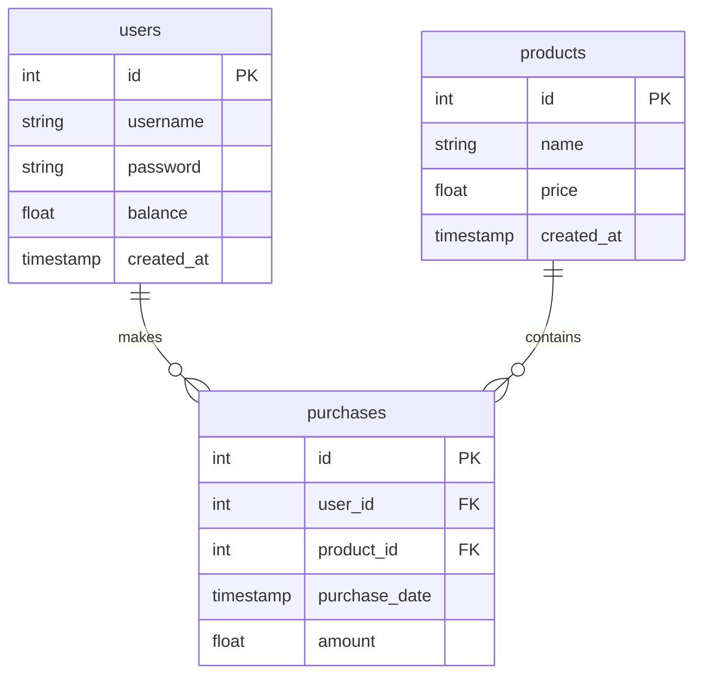

## Database

## References

1. https://elysiajs.com/patterns/deployment
2. https://elysiajs.com/essential/best-practice
3. https://github.com/jellydn/elysia-demo-app
4. https://jsonplaceholder.typicode.com/
5. https://lucia-auth.com/
6.
